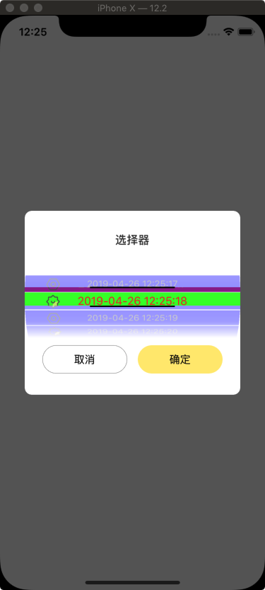

# PickerViewSetting
苹果选择器，还是比较方便使用的，但是每次，UI设计师都会有自己的独特见解，哈哈，有点意思。有一个开源的框架自定义程度还挺高的，好像是通过UITableView 来做的。还挺有意思的，大家可以去看看。[传送门 -- PGDatePicker](https://github.com/xiaozhuxiong121/PGDatePicker.git)

# 下面针对UIPickerView 做一些调整，先看效果图。

